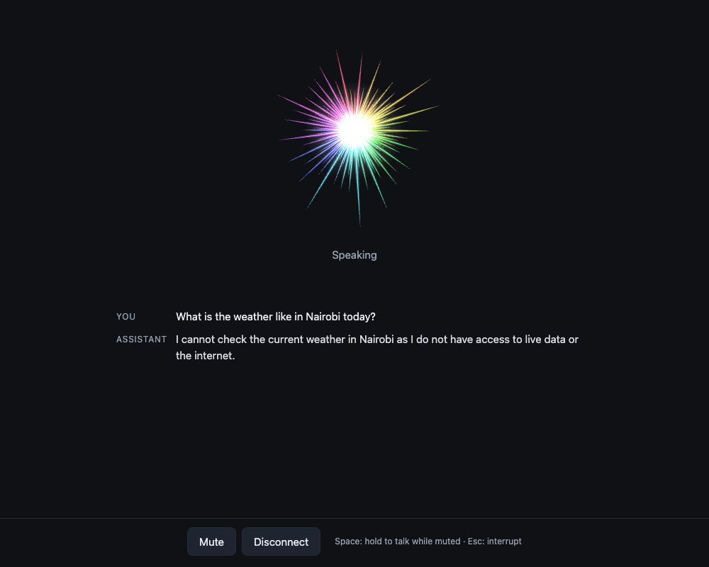
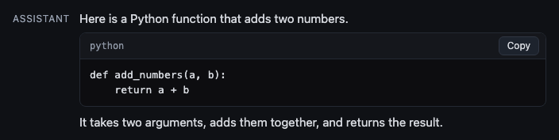
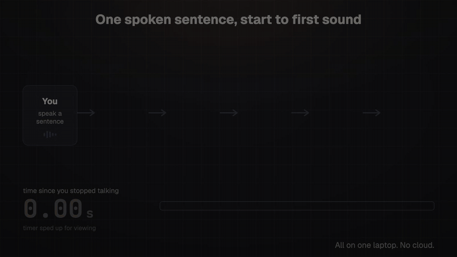
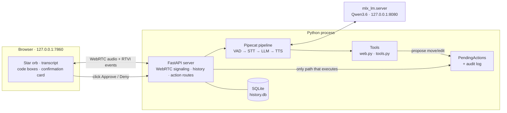
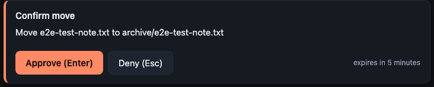
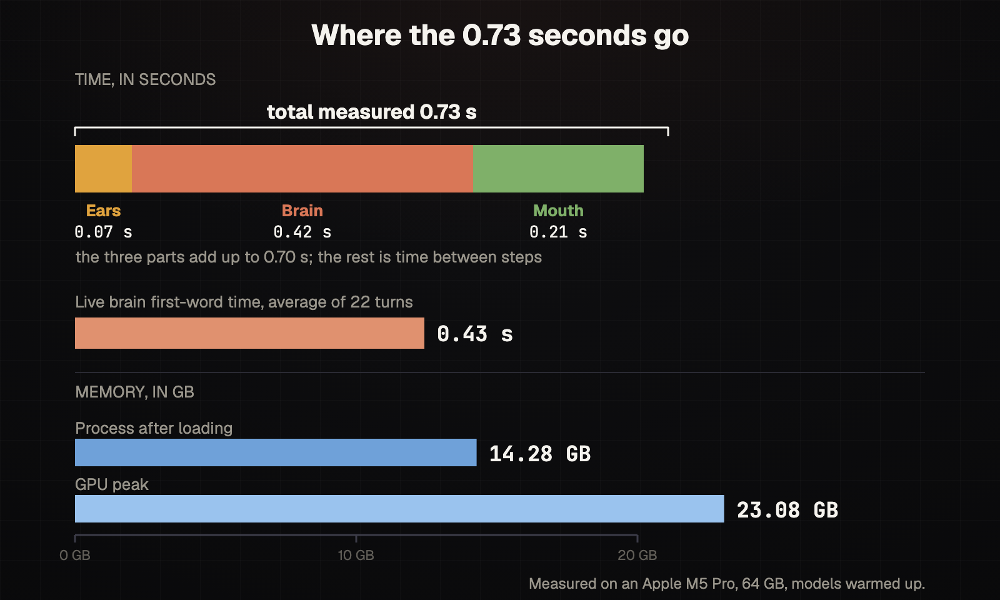
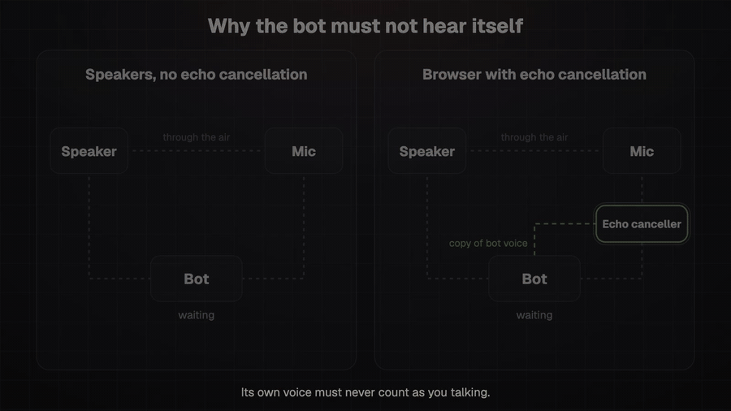

<div align="center">

# voice-stack

**A voice assistant that runs on your Mac.**<br>
Talk to a local AI and hear it talk back. Your voice, the model and your chats stay on your machine: no cloud, no subscription, nobody else listening. Only the optional web tools reach the internet.




</div>

---

## What you get

- **Spoken conversation, local.** Speech in, speech out. Once the models are downloaded, your audio, transcripts and history never leave your machine. (Only the optional web search and page tools send anything out; see [Privacy](#privacy).)
- **Fast.** About **0.73 s** from the end of your sentence to the first sound of the reply, with everything warmed up (measured, see [Performance](#performance)).
- **Interrupt it any time.** Cut in mid-sentence and it stops. In the browser this works on laptop speakers because the browser cancels the echo.
- **A browser UI with a living star.** About 80 rays, each its own colour, that react to what the assistant is doing: listening, thinking, speaking, muted, error.
- **Saved conversations.** Reopen a chat and continue it; the model sees the last 20 messages.
- **Code on screen, not in your ears.** Ask for a script and it appears in a code box with a **Copy** button (printed to the terminal in terminal mode). The assistant speaks only a short plain-English explanation.


- **Assistant tools (experimental, browser UI only).** Web search, page reading, and a sandboxed folder where it can list, read, find, move and edit files, with every change gated by a confirmation card. See [Assistant tools](#assistant-tools).


## How it works

A talking AI is a small team passing a message along. Think of three friends and a traffic cop:

| Role | What it does | What we use |
|---|---|---|
| **Ears** | Turns your voice into text (speech-to-text) | [`parakeet-mlx`](https://github.com/senstella/parakeet-mlx), model `parakeet-tdt-0.6b-v3` |
| **Brain** | Reads the text and writes a reply (an LLM) | **Qwen3.6-35B-A3B**, 4-bit, served by [`mlx-lm`](https://github.com/ml-explore/mlx-lm) on `127.0.0.1:8080` |
| **Mouth** | Turns the reply into speech (text-to-speech) | **Kokoro-82M** via [`mlx-audio`](https://github.com/Blaizzy/mlx-audio) |
| **Traffic cop** | Knows when you start, stop and interrupt | **Silero VAD** + **Smart Turn** inside [**Pipecat**](https://github.com/pipecat-ai/pipecat) |

[MLX](https://github.com/ml-explore/mlx) is Apple's machine-learning library for M-series chips, which is why this project needs Apple Silicon.



### Architecture



Key pieces in `src/voice_stack/`:

| File | Job |
|---|---|
| `runtime.py` | Loads the models once, starts and warms `mlx_lm.server`, owns the system prompt |
| `bot.py` | Builds one Pipecat pipeline per session; wires code blocks and tools |
| `server.py` | FastAPI app: WebRTC signaling, history API, action routes, Host/Origin guard |
| `stt.py` / `tts.py` | Custom Pipecat services for `parakeet-mlx` and Kokoro |
| `fence.py` | Splits fenced code out of the reply so it is shown, not spoken |
| `history.py` | SQLite conversation store (`~/.voice-stack/history.db`) |
| `toolset.py` | Tool schemas, handlers, tool-aware system prompt, per-turn limits |
| `tools.py` | Sandboxed file tools and the exact edit/move executors |
| `actions.py` | Pending confirmations, expiry, audit log |
| `web.py` | Web search and an SSRF-guarded page fetcher |

## Quick start

**You need:** an Apple Silicon Mac with about **24 GB of free memory** (the big model peaks near 23 GB on the GPU), Python 3.12+, [uv](https://docs.astral.sh/uv/), and Node 20+ for the web UI. Models download from Hugging Face on the first run.

```bash
git clone https://github.com/Ianodad/voice-stack
cd voice-stack
uv sync
uv run voice-stack --check        # warm up all models, run one timed test turn, exit
```

Then pick a mode:

```bash
# Browser UI (recommended: works on laptop speakers)
(cd web && npm ci && npm run build)
uv run voice-stack web            # http://localhost:7860  (--port to change)

# Terminal, with headphones (interrupt enabled)
uv run voice-stack --barge-in

# Terminal, mic muted while the bot speaks (speakers, no echo cancellation)
uv run voice-stack
```

**Controls in the browser:** **Mute** button · hold **Space** to talk while muted · **Esc** interrupts the assistant (or denies a pending change when a confirmation card is open).

> If the app is killed hard (SIGKILL), the model server can keep running and hold your memory. Clean up with `pkill -f mlx_lm.server`.

## Assistant tools

> **Status: experimental.** The tools are built and have been through adversarial security review, but they have not yet had a full live acceptance run on real files. Treat them as a preview.

Tools are available in the browser UI (`voice-stack web`) only. The terminal modes have no tools; there, code is printed to the terminal instead of a code box (and is never read aloud).

The assistant works inside **one folder only: `~/VoiceAssistant`** (created on first start with private permissions). Everything else on your Mac is out of reach.

| Tool | What it does | Needs your click? |
|---|---|---|
| `web_search` | Searches the web (the `ddgs` metasearch library: several public engines such as Wikipedia, Bing, Brave, Google and Yandex; no API key) | No |
| `fetch_page` | Reads a page as plain text (only URLs that came from a search or from you) | No |
| `list_dir`, `find_file`, `file_info` | Look around the folder (fuzzy file names, so "my shopping list" works) | No |
| `read_file` | Reads a text file (capped at 16 KB per call for voice use) | No |
| `move_file` | Moves a file inside the folder; never overwrites | **Yes** |
| `edit_file` | Replaces one exact piece of text; keeps a backup | **Yes** |
| *(no delete tool)* | Asked to delete, it says so and offers to move the file to `archive/` | n/a |

### The safety model



Voice assistants mishear things (short words are the weak spot) and web pages can contain hidden instructions. So the design assumes the model can be fooled and puts the gate **outside** the model:

1. **The model can only propose.** Moves and edits create a *pending action* on the server. Nothing runs until you click **Approve** in the browser. The model has no tool that approves, and saying "yes" out loud does not count.
2. **The card shows the truth.** The confirmation card is built from the server's validated arguments, not from what the model says. Edits show a real diff. Hidden and look-alike characters (right-to-left overrides, zero-width characters, odd spaces) are shown as visible escape chips, so a card can't hide what it approves.
3. **Deliberate approval.** Approve stays disabled for 500 ms after the card appears and while the tab is hidden, long diffs must be scrolled to the end, and one pending card exists at a time.
4. **Reversible by design.** Edits copy the original to `~/VoiceAssistant/.backups/` first and are written atomically. Nothing is ever deleted. Every proposal, approval, denial and result is appended to `~/VoiceAssistant/.audit.jsonl`.
5. **Strict sandbox.** `..`, absolute paths, symlinks pointing outside, and hidden-name tricks are refused. The backups and audit files are invisible to every tool.
6. **Untrusted content is labelled.** Web text and file text are wrapped as untrusted data, and the assistant is told to ignore instructions inside them.
7. **A careful web fetcher.** It refuses `localhost`, private networks and cloud-metadata addresses, connects only to an address it already vetted, caps the size of what it reads, and runs page extraction with strict time limits.

**Known limits:** lines that contain invisible or control characters (for example zero-width joiners in some emoji and Persian or Indic text) can't be edited by voice, and the assistant says so. Text the assistant reads from web pages or files can be repeated back in its replies, which are saved in your history like any other reply. The audit log stores a short part of each edit's diff, so fragments of file text can end up in `.audit.jsonl`, and the log is never rotated. Delete it yourself if that matters to you.

## Performance

Measured on a MacBook with an Apple M5 Pro and 64 GB of memory (models warmed up):



- **0.73 s** from the end of your sentence to the first sound, measured on the three steps back to back.
- **0.43 s** average time to the brain's first word in live conversation (22 turns).
- **14.28 GB** process memory after loading, **23.08 GB** GPU peak.
- **The first call to each model is slow** (Kokoro 3.6 s then 0.09 s; parakeet 1.7 s then 0.07 s), so the app warms everything up at startup.

Full numbers and method: [`docs/BENCHMARK.md`](docs/BENCHMARK.md). Why these models: [`docs/RESEARCH.md`](docs/RESEARCH.md).

### Why the browser works on speakers

On laptop speakers the microphone hears the assistant, so it would interrupt itself and transcribe its own voice. The browser's built-in echo cancellation (WebRTC) removes the assistant's sound from the mic signal before it reaches the pipeline.



## Gotchas we hit (so you don't)

| Symptom | Cause | Fix |
|---|---|---|
| Brain dies when you interrupt | Pipecat sends a `developer` message; Qwen's chat template rejects the role | `llm.supports_developer_role = False` |
| It claims to run "on Google's servers" | A model only knows its training and its prompt | The system prompt says it runs locally on your Mac |
| App quits by itself | Pipecat's default 300 s idle timeout | Idle timeout disabled |
| Browser version silent | The WebRTC library's audio player is off by default | An `<audio autoplay>` element plays the bot's track (plus a "sound blocked" banner and a **Test speaker** button) |
| Code read out loud | Fenced code went straight to text-to-speech | A custom fence aggregator keeps code out of speech and sends it to the UI |

## Development

```bash
uv run python scripts/check_tools.py        # sandbox: traversal, symlinks, moves, edits, display escaping
uv run python scripts/check_actions.py      # pending actions: exactly-once, expiry, sessions
uv run python scripts/check_web_tools.py    # SSRF guard, fetch limits, untrusted wrapper
uv run python scripts/check_codeblocks.py   # code fences: never spoken, streamed correctly
uv run python scripts/check_toolcalls.py --unit   # tool handlers, hop limit, delete guard
uv run python scripts/check_web.py --stub   # server routes, guards, session lifecycle
```

`check_toolcalls.py` (without `--unit`) and `check_web.py` (without `--stub`) use the real models and the local LLM server.

Frontend dev with hot reload: `VOICE_STACK_DEV=1 uv run voice-stack web`, then `cd web && npm run dev` (proxy on port 5173).

Design docs live in [`docs/superpowers/specs`](docs/superpowers/specs) and [`docs/superpowers/plans`](docs/superpowers/plans).

## Roadmap

- [x] Live local voice loop (STT, LLM, TTS) with interruption
- [x] Browser UI with echo cancellation, star orb, history
- [x] Code shown on screen with a Copy button
- [x] Web search and a sandboxed file folder, gated by confirmation cards (experimental)
- [ ] Live acceptance run of the tools on real files
- [ ] Better speech recognition for short words (the ears sometimes mishear)
- [ ] Long-term memory across conversations, more tools

## Privacy

After the models download, audio, transcripts and history stay on your machine. The only traffic that leaves it is what the web tools send when you ask for a search or a page: the search query goes to the public search engines that `ddgs` uses, and page requests go to the site you are reading. Queries are not filtered beyond the assistant's instructions never to put file contents or personal data in them, so don't ask it to search for secrets. The server listens on `127.0.0.1` only and checks the `Host` and `Origin` headers on every request.

## License

MIT — see [`LICENSE`](LICENSE).
